# Iris — Every thread, remembered

[](https://github.com/xcheljd/iris/actions/workflows/ci.yml)

A lightweight, self-hosted customer relationship management tool for retail clienteling: client dossiers, promo-watch matching against a model catalog, follow-up management, outreach analytics, and role-gated approvals. Built for product categories where inventory is organized by model number and collection — watches, fine jewelry, luxury goods — where a single spreadsheet stops scaling fast. One Node process, one SQLite database, zero external services.

**Self-contained by design.** One Node process, one SQLite file, no SaaS in the loop. Client data never leaves the machine; backup and restore are a file download and a file upload, not a vendor relationship.

**Built like a product, not a spreadsheet.** 1,157 tests across 94 files, ESLint-gated, CI-validated on every push. Server-driven data tables (TanStack Table v9) keep client, promo, prospect, and approval lists fast and consistent. Access is role-gated at the server-action layer — associates never hold a client record the server wouldn't let them keep.

## Quick Start

```bash
pnpm install

# Set up the database
pnpm db:push
pnpm db:seed

# Start dev server
pnpm dev
```

Open [http://localhost:3000](http://localhost:3000). Default credentials are displayed on the login page.

Production: `pnpm build && pnpm start`. The restore endpoint exits cleanly after a database swap so PM2 or systemd restarts the process with the new database in place.

## Tech Stack

| Layer | Choice |
|-------|--------|
| Framework | Next.js 16 (App Router, React Server Components) on React 19 |
| UI | shadcn/ui + Tailwind CSS 4 (CSS-first config) |
| Tables | TanStack Table v9 — shared engine (`components/data-table/`) across all list surfaces |
| Database | SQLite via better-sqlite3, full-text search (FTS5) |
| ORM | Drizzle ORM |
| Auth | NextAuth.js (Credentials provider, JWT sessions) |
| Validation | zod 4 on every mutation boundary |
| Charts | Recharts (via shadcn Chart) |
| Tests | Vitest + Testing Library (94 files, 1,157 tests) |
| Lint | ESLint 9 (flat config) |

## Screenshots

| | |
|---|---|
| 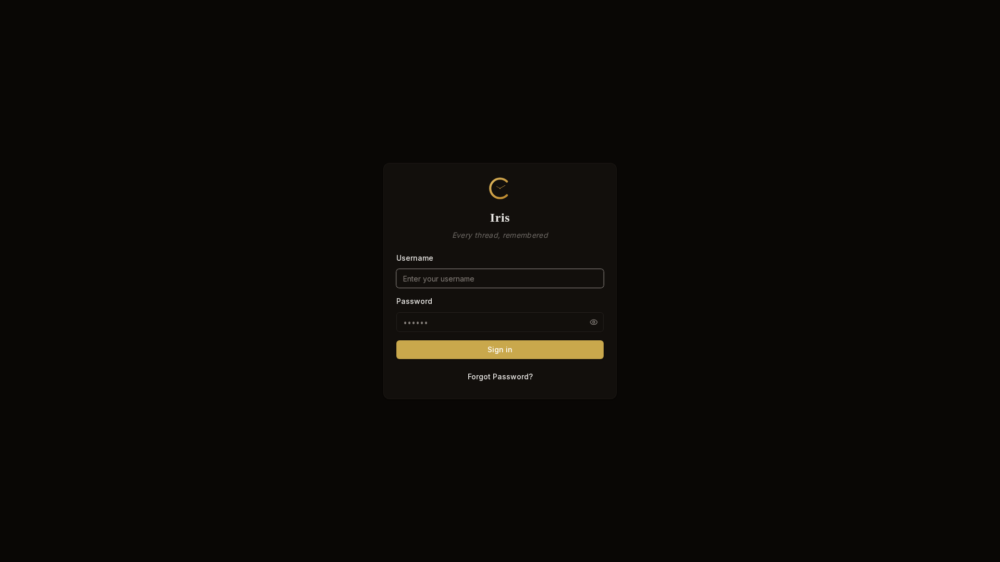 |  |
| 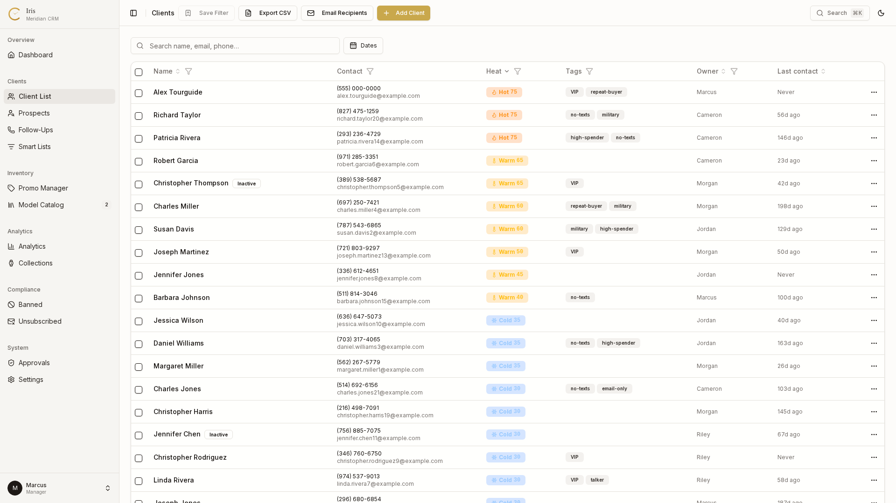 | 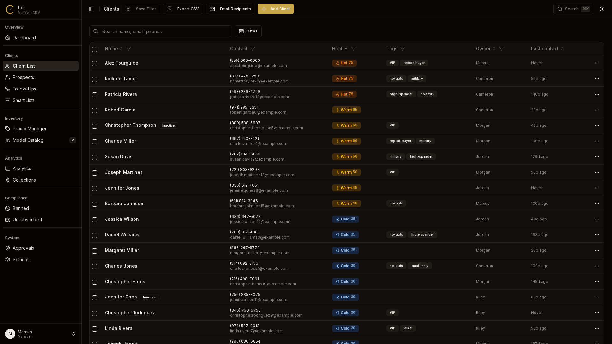 |
| 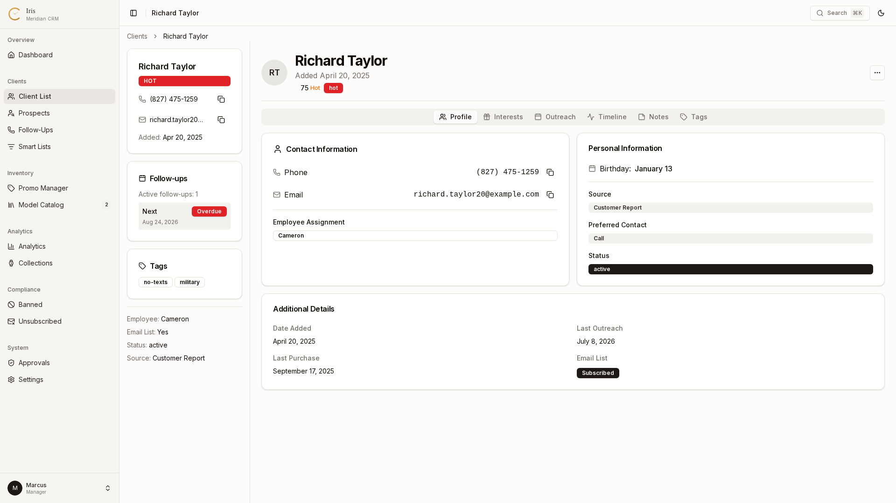 | 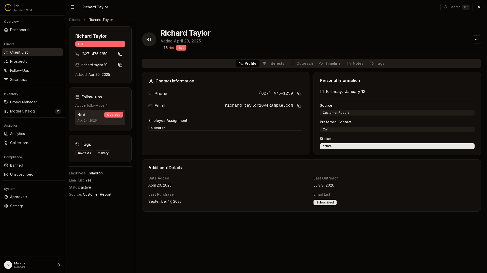 |
| 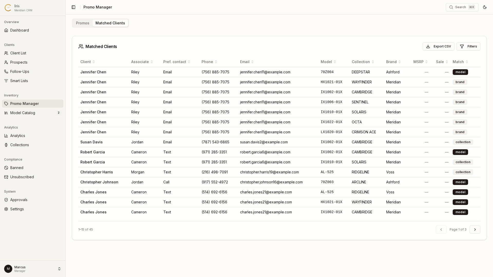 | 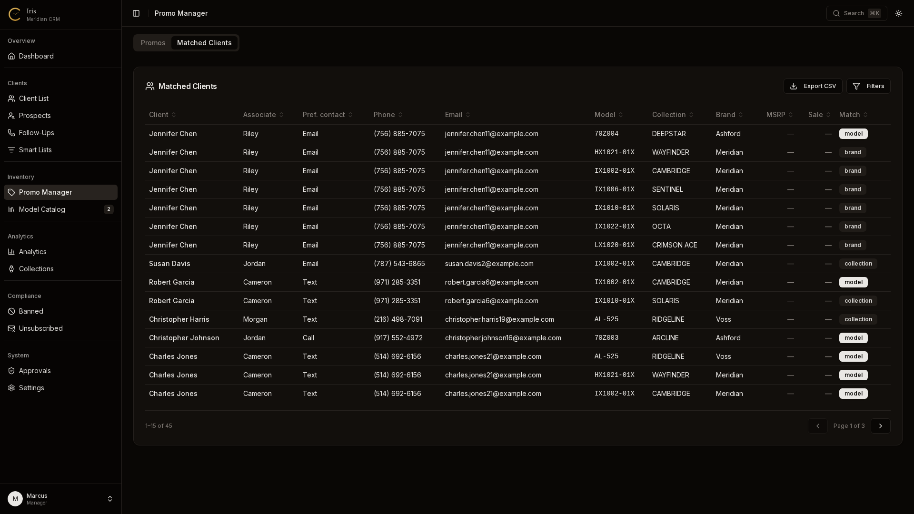 |
| 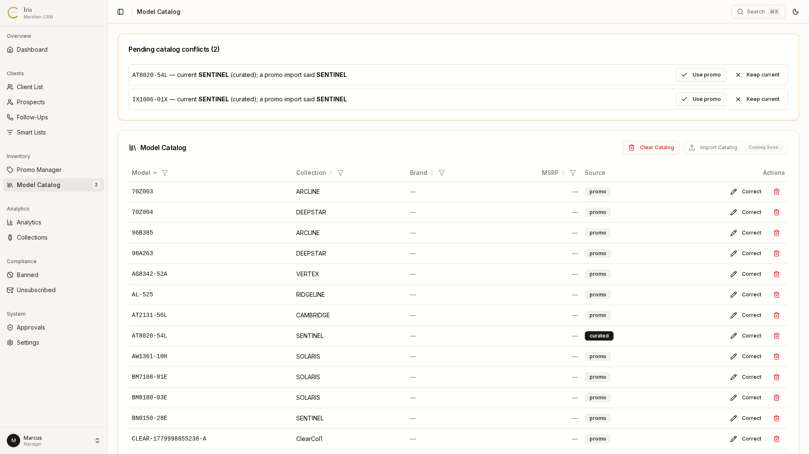 | 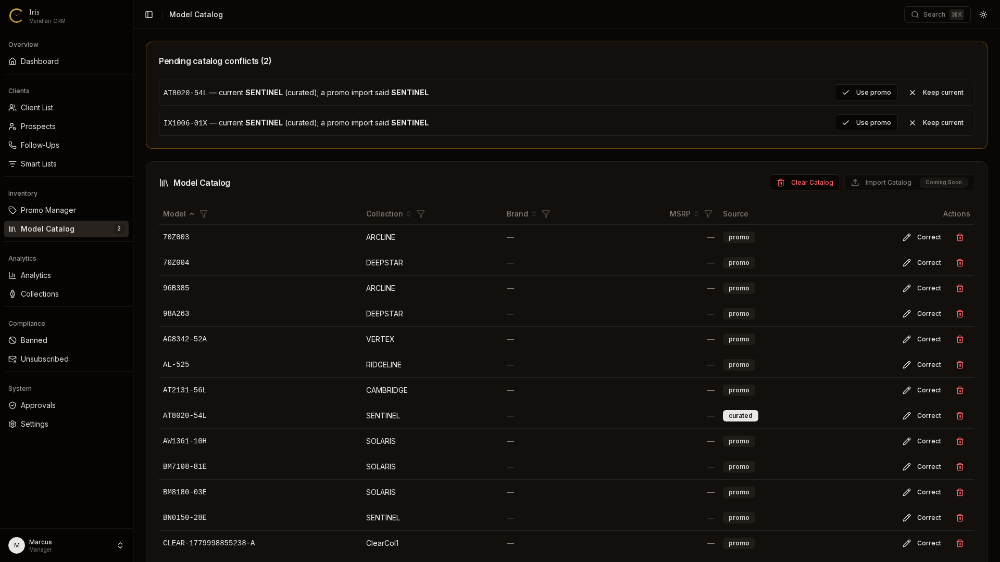 |
| 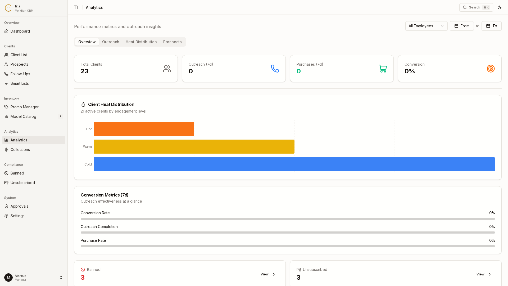 | 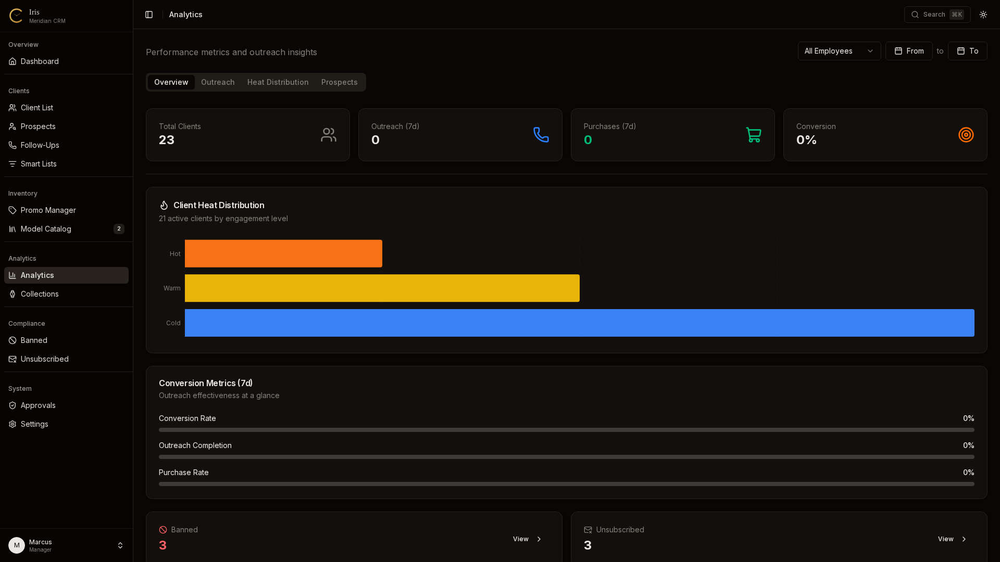 |

Every surface ships in both light and dark themes — the toggle is in the top bar, and the choice persists per user.

## Auth & Security Model

- **JWT sessions with server-side reconciliation.** The token's role/active status is re-read from `employees` on every refresh: a demoted or deactivated employee's session dies at the next token refresh, not at the 1-hour expiry cap. `SESSION_MAX_AGE_SECONDS` is 1 hour, bounding how long a stolen token stays blindly valid on a floor device.
- **Server-action gating.** Every mutation re-checks role and ownership server-side; the UI is convenience, not the security boundary.
- **PII care.** Duplicate-phone conflicts on the client-create path never leak whether a matching (possibly deleted) client exists — the API returns 409 without naming the row.

## Scripts

| Script | Description |
|--------|-------------|
| `pnpm dev` | Start development server |
| `pnpm build` | Production build |
| `pnpm start` | Start production server |
| `pnpm lint` | Run ESLint (flat config, v9) |
| `pnpm typecheck` | TypeScript, no emit |
| `pnpm db:push` | Drop FTS triggers, then push schema changes to database |
| `pnpm db:seed` | Seed database with sample data |
| `pnpm test` | Run tests (Vitest) |
| `pnpm test:watch` | Run tests in watch mode |

## Roles

| Role | Access |
|------|--------|
| **Manager** | Full CRUD, dashboard, employee management, promo + catalog config (PDF + POS report imports), analytics, banned/unsubscribed, approval queue, prospect import, database backup/restore |
| **Associate** | CRUD on own clients, view all clients, outreach logging, personal smart lists, prospect graduation/reject/unsubscribe |

Destructive actions (ban, delete, unsubscribe-list removal) flow through a manager approval queue rather than firing directly.

## Backup & Restore

The Settings → Backup tab (managers only) provides:

- **Download** — exports `iris.db` via the browser's native save dialog (Chrome/Edge File System Access API, with `<a download>` fallback)
- **Restore** — uploads a `.db` file, validates SQLite magic bytes, atomically swaps in the new file, and saves the previous database as `iris.db.bak` before restarting the server
- **Weekly reminder** — a dialog appears every Monday when the last backup is more than 7 days ago; stored in `localStorage`

## Onboarding

A built-in onboarding system (no external tour libraries) guides new users through key features on first login:

- **Guided tour** — spotlight walkthrough on first login; 8 steps for associates, 12 for managers; progress persisted in the database so it resumes across browsers; replayable from Settings → Onboarding
- **Contextual hints** — one-time hints for Add Client, Edit Client, Log Outreach, and the command palette, dismissed permanently on first interaction
- **Settings → Onboarding** — completion status, per-step progress, replay button

Built from shadcn/ui primitives: `OnboardingProvider` (state context), `TourOverlay` (spotlight cutout), `TourTooltip`, and `HintManager` (route-triggered hints).

## Documentation

See [docs/README.md](docs/README.md) for the documentation index — architecture reference, feature backlog, and the archived plan/audit trail. [`docs/ARCHITECTURE.md`](docs/ARCHITECTURE.md) covers the data model, auth flow, and design decisions, including the server-driven-list rule that the data-table engine implements.

## Environment Variables

| Variable | Required | Description |
|----------|----------|-------------|
| `NEXTAUTH_SECRET` | Yes | JWT signing secret. Must be set in production. |
| `NEXTAUTH_URL` | No | Base URL (auto-detected in dev) |

## License

Private — internal use only.
